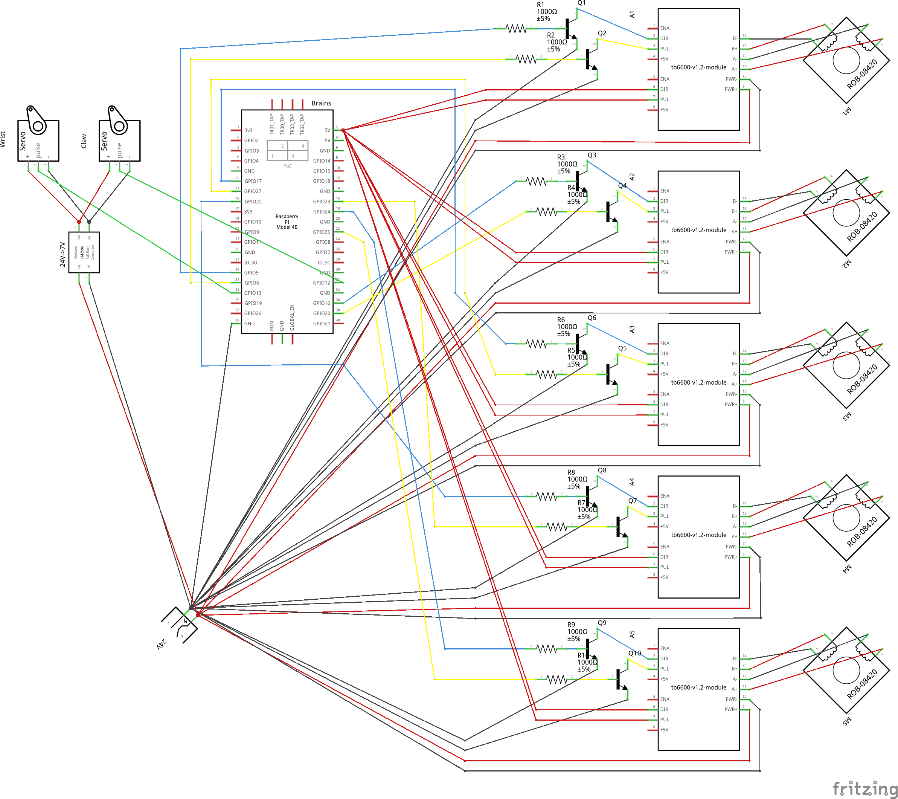

# ERA Robot Arm - Flask Web Interface

This project provides a web interface to control a robotic arm with multiple stepper motors and servo motors on a Raspberry Pi.

## Features

- Web-based robotic arm control interface
- RESTful API endpoints for motor and servo control
- Real-time continuous stepper motor control
- Servo motor control for wrist and claw
- Touch-friendly mobile interface
- Static file serving from the `public` folder

## Installation

1. Install dependencies:
```bash
uv sync
```

## Usage

1. Run the Flask application:
```bash
uv run main.py
```

2. Open your web browser and navigate to:
```
http://localhost:5000
```

3. Use the web interface to control the robotic arm:
   - **Sliders**: Control wrist and claw servos
   - **Left D-Pad**: Control base rotation (X-axis) and J1 joint (Y-axis)
   - **Right D-Pad**: Control J2 joint (X-axis) and J3 joint (Y-axis)

## API Endpoints

### Servo Control
- `POST /wrist` - Control wrist servo position
  - Body: `{"value": float}` (range: -1.0 to 1.0)
- `POST /claw` - Control claw servo position
  - Body: `{"value": float}` (range: -1.0 to 1.0)

### Stepper Motor Control
- `POST /j1` - Control J1 joint (dual stepper motors)
  - Body: `{"enabled": bool, "direction": "forward"|"backward"}`
- `POST /m3` - Control base rotation (M3 stepper motor)
  - Body: `{"enabled": bool, "direction": "forward"|"backward"}`
- `POST /m4` - Control J2 joint (M4 stepper motor)
  - Body: `{"enabled": bool, "direction": "forward"|"backward"}`
- `POST /m5` - Control J3 joint (M5 stepper motor)
  - Body: `{"enabled": bool, "direction": "forward"|"backward"}`

### Static Files
- `GET /` - Serves the main web interface
- `GET /<filename>` - Serves static files from the public directory

## Requirements

- Raspberry Pi with GPIO access
- Python 3.12+
- Flask
- gpiozero
- rpi-lgpio

## Hardware Setup



### Stepper Motors
- **M1 (J1 Left)**: DIR=GPIO 5, PUL=GPIO 6
- **M2 (J1 Right)**: DIR=GPIO 16, PUL=GPIO 20
- **M3 (Base)**: DIR=GPIO 17, PUL=GPIO 27
- **M4 (J2)**: DIR=GPIO 22, PUL=GPIO 23
- **M5 (J3)**: DIR=GPIO 24, PUL=GPIO 25

### Servo Motors
- **Wrist**: GPIO 13
- **Claw**: GPIO 12

## Motor Configuration

- **J1 Joint**: Uses dual stepper motors (M1 and M2) for synchronized movement
- **Base, J2, J3**: Individual stepper motor control
- **Wrist & Claw**: Standard servo motors with position control

## Development

The Flask app runs on host `0.0.0.0` port `5000` with debug mode disabled for production use.

## Systemd Service

A systemd service is provided for automatic startup:
- Service file: `systemd/era-robot-arm.service`
- Installation script: `systemd/install.sh`
